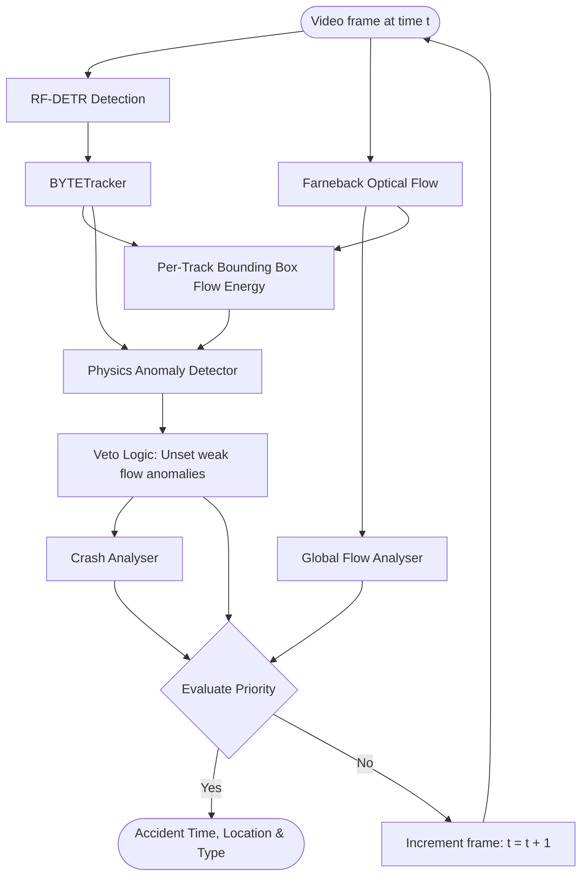
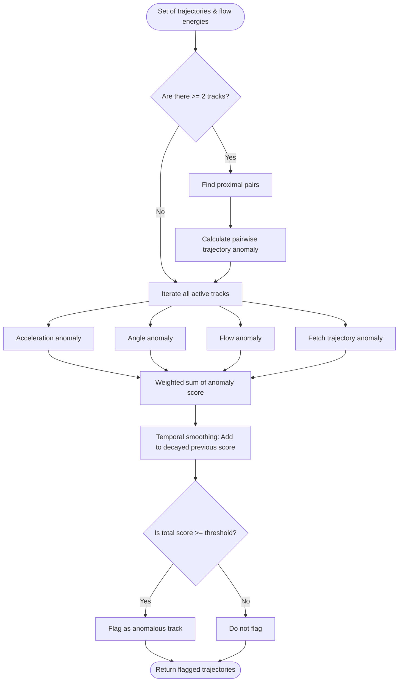
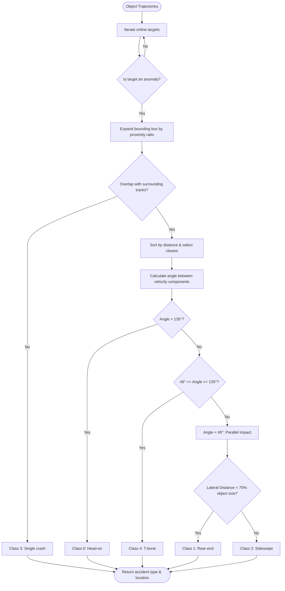

# CrashCar

This is an experimental project developed when I participated in the CVPR AUTOPILOT 2026 competition. It primarily utilizes classical computer vision techniques and kinematic constraints applied to tracked vehicles to detect and classify accidents. The dataset contains CCTV footage of vehicle accidents and simulated accidents with CARLA.

<video src="doc/combined_success.mp4" controls="controls" style="max-width: 100%;">
  Your browser does not support the video tag.
</video>

## Detection Pipeline

The pipeline uses the RF-DETR object detector to identify vehicles in each frame, feeding these detections into BYTETracker to extract trajectory associations. Simultaneously, optical flow energy is calculated for the entire frame and specifically within the bounding boxes detected by RF-DETR. 

A physics anomaly detector then processes these tracked trajectories alongside the object flow energies. Veto logic is applied to filter out noise from mostly stagnant objects. If no objects are detected, a parallel global flow analyzer identifies anomalous frames and locates accidents based on high local optical flow energy. Physics-based anomalies are always prioritized over optical flow-based ones.

### Anomaly Detector

The physics anomaly detector evaluates four types of anomalies based on tracked trajectories and optical flow energies:

1. **Acceleration Anomaly**

   Acceleration is approximated by $a = \frac{\Delta S}{\Delta t}$, where speed is $S = \|\mathbf{v}_{norm}\|$. The tracked velocity is normalized by the object's size $\mathbf{v}_{norm} = \frac{(v_x, v_y)}{\sqrt{w^2 + h^2}}$, making the acceleration depth-invariant. Sudden decelerations flag an anomaly.

2. **Trajectory Anomaly**

   This detects potential collisions between pairs of tracks by predicting their future positions and analyzing their relative movement. If the tracks are approaching ($v_{close} > \text{threshold}$), expected to overlap at $t_{closest}$, and their movement alignment is $\frac{\mathbf{v}_{rel}}{\|\mathbf{v}_{rel}\|} \cdot \frac{\mathbf{d}}{\|\mathbf{d}\|} > 0.90$, it flags an anomaly.
   Where,
   closing speed: $v_{close} = \frac{\mathbf{v}_{rel} \cdot \mathbf{d}}{\|\mathbf{d}\|}$,
   time to closest approach: $t_{closest} = \frac{\mathbf{d} \cdot \mathbf{v}_{rel}}{\|\mathbf{v}_{rel}\|^2}$,
    relative velocity $\mathbf{v}_{rel} = \mathbf{v}_1 - \mathbf{v}_2$, and the distance vector $\mathbf{d} = \mathbf{p}_2 - \mathbf{p}_1$.

3. **Angle Anomaly**

   Identifies sudden directional changes, indicating a collision or abrupt swerve. It tracks movement vectors over a time step: $\mathbf{v}_{prev} = \mathbf{p}_2 - \mathbf{p}_1$ and $\mathbf{v}_{curr} = \mathbf{p}_3 - \mathbf{p}_2$. It computes the angle between these vectors: $\theta = \arccos\left(\frac{\mathbf{v}_{prev} \cdot \mathbf{v}_{curr}}{\|\mathbf{v}_{prev}\| \|\mathbf{v}_{curr}\|}\right)$. If $\theta > \theta_{threshold}$, an anomaly is registered.

4. **Flow Anomaly**

   Detects sudden spikes in optical flow energy within the object's bounding box, which corresponds to sudden pixel movements caused by collisions. It computes a baseline mean ($\mu$) and standard deviation ($\sigma$) from the historical flow energy of the track. For the current flow energy $E_{curr}$, the Z-score is calculated as $Z = \frac{E_{curr} - \mu}{\sigma}$. If $Z > Z_{threshold}$, it flags a flow anomaly.

### Crash Analyser

This model processes the anamolous trajectories flagged by physics based anamoly detector. It classifies the accident type according to the direction of movement of vehicles.

## Pipelines

You can run any of the following pipelines and modify hyperparameters in `configs/accident_prediction_config.py`:

1. **Inference Pipeline (`src/pipeline/inference.py`)**
   Runs the end-to-end detection process presented in the diagrams above on a single input raw video and outputs a labeled video.
2. **Training Pipeline (`src/pipeline/trainer.py`)**
   Trains a transformer model for three objectives: anomaly detection, spatial localization, and type classification. The transformer learns from sequences of object trajectories. This approach was not helpful much, as the labeled CARLA simulator dataset differs significantly from real CCTV accident footage.
3. **Testing Pipeline (`src/pipeline/test.py`)**
   Runs the end-to-end detection on a series of test videos and returns the detections and accident types in a CSV file.
4. **Hyperparameter Optimization (`src/pipeline/optimize_hyperparam.py`)**
   Given the large number of hyperparameters in the anomaly detector, this uses `Optuna` to tune critical thresholds (e.g., flow spike thresholds, acceleration bounds, proximity ratios) to balance false positives and false negatives under varying scenarios of CARLA simulator data.

### Failure Cases

<video src="doc/combined_failure.mp4" controls="controls" style="max-width: 100%;">
  Your browser does not support the video tag.
</video>

* Optimal thresholds and kinematic constraints change depending on camera mounting, depth, and perspective.
* These kinematic rules often fail in heavy traffic and chaotic scenarios.
* As the dynamic interactions between objects become more complex, we would indefinitely need to add an increasing number of constraints to account for all edge cases.
